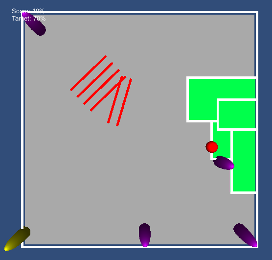

# Unity Qix

## Introduction

Qix was first made back in the early 1980s - see [Wikipedia](https://en.wikipedia.org/wiki/Qix).  This is a quick mock-up I made using [Unity](https://unity.com/).

## Game notes

I managed to fix up a few basic things as I resurrected this, but some other bits not quite yet - e.g.
 - drawing the trail as the player draws a new line
 - end game states (though I don't think I ever got as far as multiple levels)
 - randomizing enemy positins, etc.

Still, it's very loosely speaking playable, and at least everything is "textured" now not bright pink lol.

## Screenshots

### My version

### Original version

## Design notes

I made this game ages ago (2012?), in a rush, so the code is *not* good!   

I guess the main "interesting" bit is the rectangle filling in logic.  But I don't think this is done in a very sane way.

## Licensing

Feel free to modify/update the code, so long as you reference back here and thank the fine folk at Taito for coming up with the idea!
